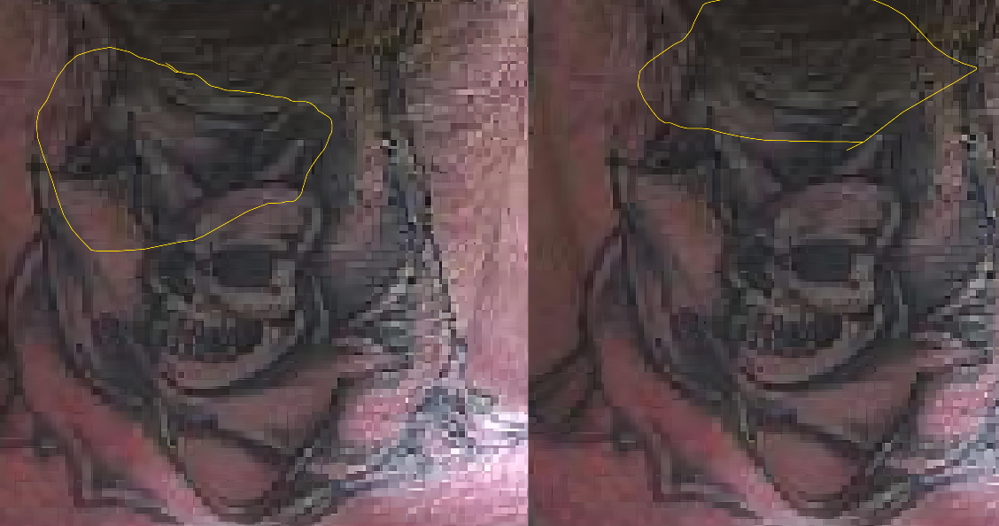
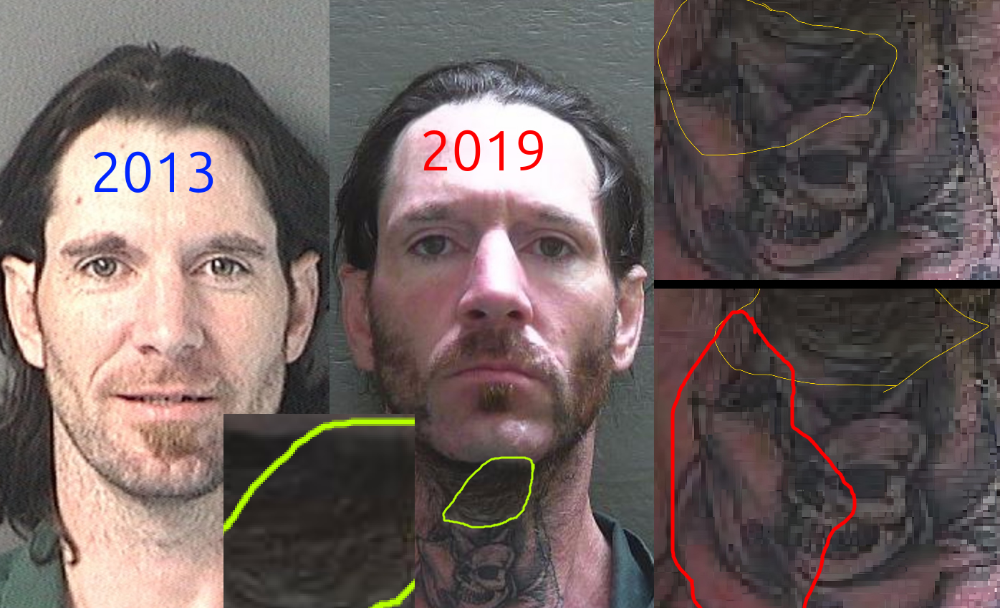
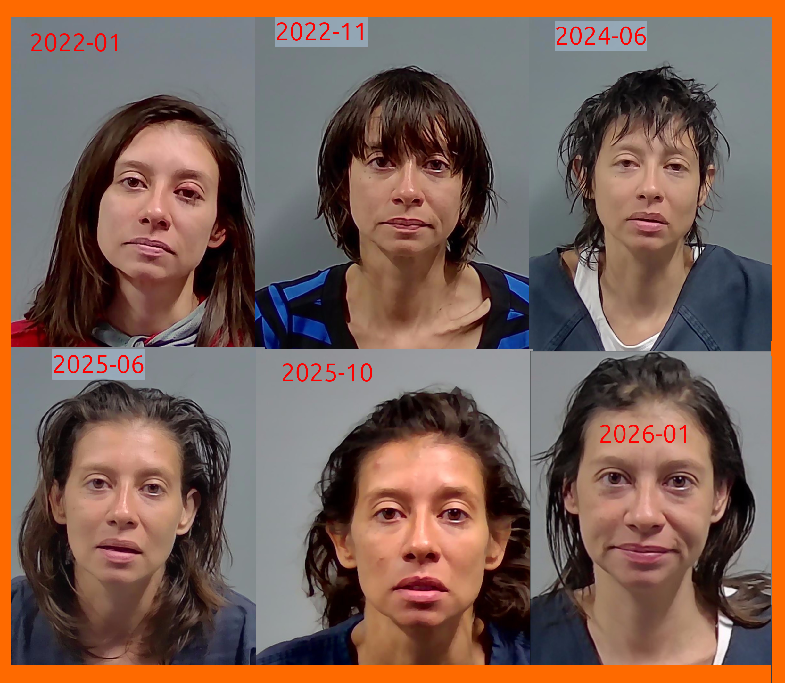

# Photo Examples

Some friends of mine in the Shores area. My understanding is that Sammy was programmed with the Friz formula as a child, and then programmed Lil. 

When looking over the contents of this book, I easily identified them as having been programmed with it, having endless backups if certain personalities were overly disrupted. 

The formula involves traumatizing the brain into a blank slate which follows instructions flawlessly without fail. 

These mind-control slaves appear to have evolved, since the writing of Fritz, into psychic superpowers.

Over time, the creations over-power their creators. and gain god-like powers that are quite challenging to remediate. 

## Scammy Evil Faced Art

Closely examining the art on his neck, you can see him creating an etheric personality, much in the same way that the personality is programmed in Fritz's method. 

### 80%-98.99% Consumed by Death

## Lilly ScamHeld

 

[Lilly-Scamheld-22-01.jpeg](Lilly-Scamheld-22-01.jpeg)
[Lilly-Scamheld-22-11.jpeg](Lilly-Scamheld-22-11.jpeg) 
[Lilly-Scamheld-24-02.jpeg](Lilly-Scamheld-24-02.jpeg) 
[Lilly-Scamheld-24-06.jpeg](Lilly-Scamheld-24-06.jpeg) 
[Lilly-Scamheld-25-06.jpeg](Lilly-Scamheld-25-06.jpeg) 
[Lilly-Scamheld-25-10.jpeg](Lilly-Scamheld-25-10.jpeg)
